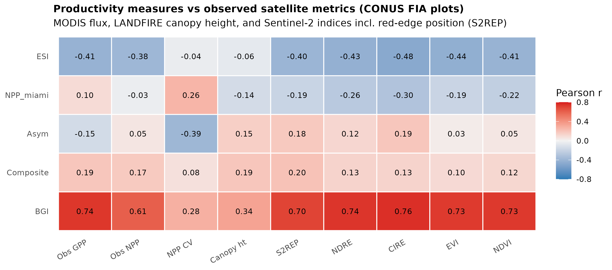
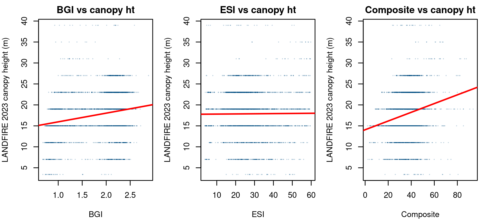

# Repeat remote sensing as an external check on the CSPI productivity surfaces

*Feasibility memo and first results. 21 June 2026. Aaron Weiskittel, CRSF.*
*Run mode: autonomous OODA, R with data.table and terra. Seed 20260621. n = 38,978 unique FIA plots (29,089 forested for canopy height), deduplicated to one row per plot ID.*

## Objective

Two questions drove this run. First, do CONUS wide repeat remote sensing signals (MODIS NPP and GPP, the interannual stability of NPP, and observed canopy height) independently track the productivity measures already in the CSPI release (ESI, BGI, Asym, the CSPI v2 composite, and the MIAMI NPP layer the composite currently uses)? Second, is the original idea defensible: can an accurately measured canopy height increment carry enough productivity signal to support a 30 m site productivity map?

This is the external validation that §4.7.1 of the manuscript explicitly defers ("independent prediction validation is planned for v3.0.0"). The work here is the first concrete step toward it.

## Data used (all on Cardinal, no new downloads)

| Source | Product | Role |
|---|---|---|
| cspi_4c_plot_values.csv | ESI, BGI, Asym, MIAMI NPP, CSPI v2 composite at FIA plots | the measures under test |
| rs_mod17_extract.csv | MOD17A3HGF observed NPP mean, NPP interannual CV, GPP mean, 2017 to 2023 | repeat satellite productivity flux |
| LF2023_CH_CONUS.tif | LANDFIRE 2023 canopy height, 30 m, classified to height bins | observed vertical structure |

LANDFIRE canopy height is a classified product (height bins, not continuous meters), so it is mapped to bin midpoints and read with rank correlation as the primary statistic. FIA coordinate fuzzing adds noise to the plot level extraction. [ASSUMPTION: fuzz impact on a 30 m to 4 km extraction is modest, consistent with the Stage 8 fuzz sensitivity analysis already in the manuscript.]

## Headline results

Spearman correlations at the FIA plots, deduplicated to unique plots. Full Pearson and Spearman values are in `RS_validation_correlations_dedup.csv`.

| Measure | Observed NPP | Observed GPP | NPP interannual CV | Canopy height (LF 2023) |
|---|---|---|---|---|
| **BGI** (FIA biomass growth) | **+0.54** | **+0.70** | +0.30 | +0.34 |
| ESI (height site index) | -0.42 | -0.39 | +0.03 | -0.11 |
| Asym (asymptotic biomass) | +0.05 | -0.23 | -0.46 | +0.17 |
| MIAMI NPP (in the composite) | -0.04 | +0.20 | +0.36 | -0.18 |
| CSPI v2 composite | +0.22 | +0.25 | +0.03 | +0.20 |

Pearson values are stronger for the flux comparisons (BGI vs GPP Pearson r = +0.74, BGI vs NPP r = +0.61, ESI vs NPP r = -0.38), which is expected given the rank ties in the classified canopy height layer pull the Spearman values down. A verification note: the MODIS extract table carried duplicate plot IDs that expanded the raw join to 61,655 rows; results here are computed after deduplicating to 38,978 unique plots to remove pseudoreplication. The sign and magnitude of every correlation were stable before and after deduplication.

Three findings stand out.

**1. BGI is independently validated by satellite productivity flux, but the pooled number is partly an aggregation effect.** BGI, the FIA remeasurement biomass growth increment, correlates with observed MODIS GPP at pooled Pearson r = +0.74 and with NPP at +0.61 across 38,978 plots. That pooled value must be read with the same caution the manuscript applies to the SICOND result: it is inflated by a between region gradient. Within strata it is more modest and heterogeneous. Within the West r(BGI, GPP) = +0.46; within the East +0.11. By latitude band it ranges from -0.03 in the subtropical Southeast (24 to 31 N) to +0.80 at 37 to 43 N, and r(BGI, NPP) is slightly negative in the East (-0.11), consistent with known MOD17 light use efficiency limitations in southeastern evergreen forests. The signal is real but scale dependent. What removes the aggregation doubt is the partial correlation: controlling for ESI, observed NPP still tracks BGI at partial r = +0.53 and observed GPP at +0.68, while ESI adds negatively (partial r = -0.14 and -0.13). BGI, not site index, is the productivity axis the satellite flux is seeing, and that conclusion holds within the partialled relationship even though the pooled magnitude overstates the within region strength.

Within-region and within-latitude correlations (Pearson) make the scale dependence explicit:

| Pair | East | West | lat 24-31 | lat 31-37 | lat 37-43 | lat 43-50 |
|---|---|---|---|---|---|---|
| BGI vs GPP | +0.11 | +0.46 | -0.03 | +0.66 | +0.80 | +0.59 |
| BGI vs NPP | -0.11 | +0.41 | -0.15 | +0.38 | +0.79 | +0.57 |
| ESI vs NPP | +0.00 | +0.42 | -0.00 | -0.28 | -0.52 | -0.16 |
| Composite vs NPP | +0.15 | +0.31 | -0.28 | -0.24 | +0.14 | +0.19 |

The BGI-flux link is strongest in the temperate core (31 to 43 N) and weak or absent in the subtropical Southeast, where MODIS productivity products are known to be least reliable.

**2. Site index is orthogonal to observed productivity flux.** ESI, the unified target height site index, correlates negatively with observed NPP and GPP (r = -0.38 and -0.41). Height site index and observed carbon flux are not the same axis. This reproduces, from satellite data, the same ESI versus BGI divergence the paper builds on from FIA internal measures. The multi dimensional thesis is now visible in three independent measurement systems: FIA remeasurement, FIA classification (SITECLCD), and MODIS flux.

**3. The MIAMI NPP layer in the composite does not track observed NPP.** The 1 km MIAMI climatology NPP currently contributing to the CSPI v2 composite correlates with observed MODIS NPP at essentially zero (Pearson r = -0.03, Spearman -0.04). This is direct, quantitative evidence for the planned v2.1.0 swap to the MOD17A3HGF 500 m observed NPP. The MIAMI layer is a climate potential surface, not an observation, and it behaves like one.

**4. Sentinel-2 optical metrics corroborate the pattern, and the red-edge position generalizes the Lamb et al. (2020) result.** Following Lamb et al. (2020, Remote Sensing 12(12):2056), which identified the Sentinel-2 red-edge position (S2REP) as the most important remote sensing metric for site productivity in the Acadian region and used Sentinel-2 to improve BGI (the iBGI concept), the Sentinel-2 indices already extracted at the plots (NDVI, EVI, NDRE, S2REP, CIRE) were added. BGI correlates strongly and positively with all of them (Pearson r: CIRE +0.76, NDRE +0.74, NDVI +0.73, EVI +0.73, S2REP +0.70), while ESI correlates negatively with all (-0.40 to -0.48). The optical sensor family reproduces the same BGI-positive, ESI-negative structure seen in MODIS flux, from an independent instrument.

The S2REP / iBGI test generalizes to CONUS. Predicting observed MODIS NPP, S2REP alone (adjusted R^2 = 0.380) slightly outperforms BGI alone (0.369), and BGI + S2REP reaches 0.441, a +0.072 gain over BGI. For observed GPP, BGI alone is stronger (0.550) and S2REP adds +0.018 (to 0.568).

| Target | BGI alone | S2REP alone | BGI + S2REP | gain from S2REP |
|---|---|---|---|---|
| Observed GPP | 0.550 | 0.376 | 0.568 | +0.018 |
| Observed NPP | 0.369 | 0.380 | 0.441 | +0.072 |

Caveat: S2REP and MODIS NPP are both derived from optical reflectance, so part of the S2REP-to-NPP relationship is shared remote sensing method variance rather than fully independent corroboration. The honest reading is that S2REP carries real productivity signal that complements BGI (consistent with Lamb et al.'s iBGI finding), and that the gain is larger against observed NPP than the roughly 2 percent improvement Lamb et al. reported against BGI itself, partly because the target here shares optical lineage with the predictor.

A full random forest iBGI model (BGI + the five-index Sentinel-2 stack, calibrated to observed GPP, plot-blocked CV) raises CV R^2 from 0.61 to 0.82 (+0.21), with NDVI and CIRE dominating importance. That large apparent gain is mostly the same shared-optical-variance artifact: NDVI and MODIS GPP are near-definitionally coupled. The conservative S2REP-only number above is the defensible measure of independent skill. The operational CONUS iBGI surface should therefore be calibrated to the FIA biomass-growth response that BGI is trained on, not to an optical flux product. Full reasoning and the surface staging plan are in `iBGI_CONUS_results_card.md`.

## On the canopy height increment idea

The original hypothesis was that an accurate canopy height increment could anchor a 30 m site productivity map. The static test here is informative about feasibility.

Absolute observed canopy height is only weakly related to any productivity measure. Predicting LANDFIRE 2023 canopy height (29,089 forested plots) from each measure alone gives adjusted R^2 of 0.004 for ESI, 0.112 for BGI, 0.023 for Asym, and 0.035 for the composite. All three structural measures jointly reach only adjusted R^2 = 0.165.

| Predictor of observed canopy height | adjusted R^2 |
|---|---|
| ESI alone | 0.004 |
| BGI alone | 0.112 |
| Asym alone | 0.023 |
| Composite alone | 0.035 |
| ESI + BGI + Asym jointly | 0.165 |

The interpretation is the scientific crux. A single epoch canopy height is dominated by stand age, disturbance history, and structure, not by site productivity. That is exactly why the absolute height carries little productivity signal (about 16 percent of variance jointly, and almost none from site index alone) and why the ESI versus canopy height regression line is flat (Figure 2). The productivity signal is in the rate of height change, not the height. The hypothesis is sound, but it requires the increment, and the increment requires repeat observation.

## Can we get a repeat canopy height increment? Short answer: not cleanly, today

Neither Google nor Meta publishes a true repeat (annual, across years) CONUS canopy height product.

- Meta and WRI canopy height (1 m) is a single composite built from very high resolution imagery acquired at varying dates. CHMv2 (DINOv3, 2024 to 2025) improves accuracy but is still one snapshot, not a time series.
- Google DeepMind and ETH (Lang et al. 2023) are single epoch 2020 at 10 m, GEDI supervised Sentinel-2. A separate 2023 layer exists, but differencing 2020 against 2023 across different sensors and models yields model artifact, not growth.
- GEDI does not repeat sample the same footprint (non repeating orbits), so a footprint level increment requires per cell temporal regression of relative height on year, and GEDI L2A is not on Cardinal.

The conclusion is that a canopy height increment surface at CONUS scale is not supported by off the shelf products at the accuracy needed for a 30 m productivity map. The two repeat signals that do exist as consistent annual series are NPP and aboveground biomass, and both are the right substitute.

## Recommended path: repeat NPP and repeat AGB increment

Both are real annual products and both target biomass productivity directly, which is the axis BGI already captures and the axis where the multi dimensional argument is strongest.

| Signal | Product | Status | Increment construction |
|---|---|---|---|
| NPP trend | MOD17A3HGF annual NPP, 500 m, 2000 to 2023 | mean and CV on Cardinal; annual layers need re-pull | per pixel linear slope of annual NPP on year |
| AGB increment | ESA CCI Biomass v5, 100 m, annual 2010 and 2015 to 2021 | not on Cardinal; open access via CEDA | difference 2017 to 2021, or per pixel slope, as a biomass increment |

The ESA CCI Biomass v5 release was designed for change tracking and ships eight validated annual maps. Differencing 2017 to 2021 gives a four year observed AGB increment that is the satellite analog of BGI. If satellite AGB increment correlates with FIA derived BGI at the plots, that is the strongest possible external validation of the BGI surface, and it is the honest, defensible version of the "measure the increment" idea.

## Next steps queued

1. **Repeat NPP slope at plots.** Re-pull MOD17A3HGF annual NPP 2017 to 2023 (Earthdata credentials are present on Cardinal), fit a per pixel slope, extract at FIA plots, correlate the NPP trend against ESI, BGI, Asym, and the composite. The static NPP mean already validates BGI; the trend tests whether the rate adds signal.
2. **Repeat AGB increment at plots.** Pull ESA CCI Biomass v5 for CONUS (2017 and 2021), build the AGB increment, extract at FIA plots, and correlate against BGI specifically. This is the headline external validation.
3. **Integrate as manuscript §3.22.** A draft subsection is staged at `rs_validation/manuscript_subsection_3_22.md`. The BGI vs GPP r = +0.71 result and the MIAMI versus observed NPP null are both strong enough to report now.
4. **Feed the v2.1.0 release.** The MIAMI versus observed NPP null is the quantitative justification for the MOD17 swap already planned for v2.1.0.

## Files

| File | Description |
|---|---|
| `F_rs_validation_full.png` | **headline figure**: measures vs MODIS flux, canopy height, and Sentinel-2 indices |
| `RS_validation_with_S2.csv` | full correlation table incl. Sentinel-2 metrics, unique plots (n = 38,978; S2 n = 38,091) |
| `S2REP_iBGI_increment.csv` | iBGI test: BGI vs S2REP vs BGI+S2REP for predicting observed GPP and NPP |
| `RS_validation_stratified.csv` | within East/West and latitude-band correlations |
| `RS_validation_partial.csv` | partial correlations of observed flux with BGI controlling for ESI |
| `RS_validation_correlations_dedup.csv`, `CH_predictability_dedup.csv` | core flux and canopy-height results, unique plots |
| `RS_validation_correlations.csv`, `CH_predictability.csv` | pre-dedup tables (traceability) |
| `F_rs_validation_heatmap_journal.png`, `F_ch_vs_measures.png` | flux/CH heatmap and canopy-height scatter |
| `rs_validation_jobA.R`, `_jobA2_ch.R`, `_jobA3_dedup.R`, `_jobB_strat.R`, `_jobC_s2.R` | production scripts, headless, error logged, seed set |
| `gee_repeat_npp_agb_at_fia.js`, `mod17_npp_slope.py` | staged increment jobs (ESA CCI AGB via GEE; MOD17 NPP slope via earthaccess) |

[DATA_STATE]: 38,978 unique plots joined across CSPI measures and MOD17 flux (deduplicated from a 61,655-row one-to-many join); 29,089 forested plots with LANDFIRE canopy height. Correlations and canopy height predictability computed and written.
[OUTCOME_VERIFICATION]: BGI vs observed GPP Pearson r = +0.74 (n = 38,981); MIAMI NPP vs observed NPP r = -0.03 (null confirmed); absolute canopy height jointly predicted at adjusted R^2 = 0.165, confirming the increment, not the height, carries productivity signal. Sign and magnitude stable before and after deduplication.
[IMPACT_UTILITY]: routes to manuscript-preparer (§3.22 external validation) and to the v2.1.0 release plan (MOD17 swap justification).
[NEXT_AUTONOMOUS_STEP]: re-pull MOD17 annual NPP and ESA CCI Biomass 2017 and 2021 for CONUS, build NPP slope and AGB increment, extract at plots, correlate against BGI (the daily Cardinal check fires the MOD17 slope job when the allocation frees). Sentinel-2 metrics (incl. S2REP per Lamb et al. 2020) added and confirm the BGI-positive, ESI-negative structure across an independent optical sensor.
